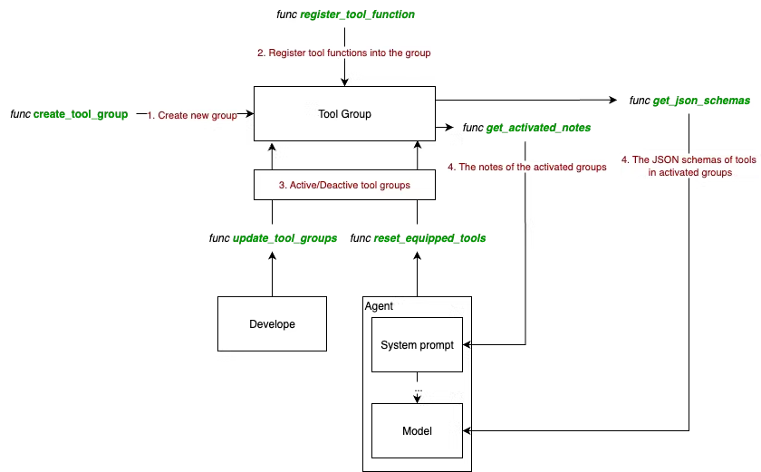
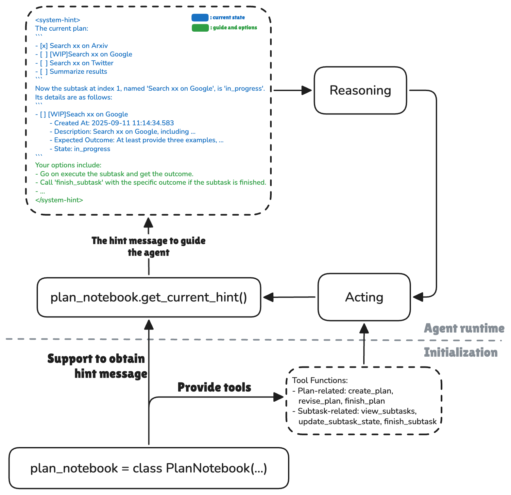
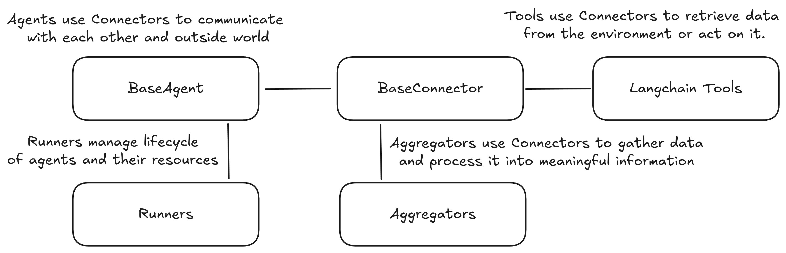
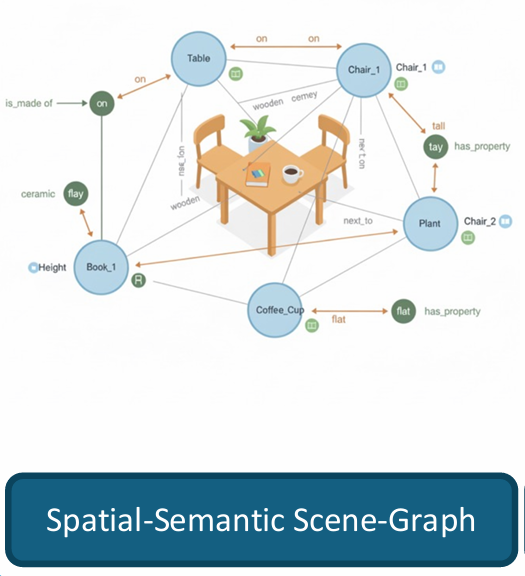

# 2026 Working Progress  
## By 2026/1/7  
* 继续调基于本地LLM的MCP Client（Flag回收）  
    * 优化**推理效率**方面的尝试
        * 摸了下`vllm`框架，期望通过该框架优化推理开销（**降低推理延时+降低显存开销**），但是没有成功：
            * `vllm`框架目前对`VLA`的支持不是很好，参考[vllm官方vla示例](https://github.com/vllm-project/vllm/blob/main/examples/offline_inference/vision_language.py)把`RoboBrain2.0`缝进去；官方示例使用的对话模板是qwen2.5-vl的，需要替换为[修改后含工具调用的jinja模板](https://github.com/YouCaiJun98/mcp-client/blob/main/template/template.jinja)。
            * `vllm`主要面向的是**高并发场景下的大模型推理服务**，它的主要目的是在生产环境中同时服务多个用户，主要的技术贡献在于**显存管理**，用`PageAttention`等技术减少碎片化显存（在这一意义上，它是设计来替代`Pytorch`显存管理方案的）；尽管vllm支持部署量化后的LLM，留有相关的量化接口，但是它并没有集成量化模块，用户须在其他框架下进行模型量化，再将模型迁移到`vllm`中。自己量化`RoboBrain2.0`不太可行，因为需要利用该模型的训练数据做量化参数校正，已在`RoboBrain2.0`官方repo提了[issue](https://github.com/FlagOpen/RoboBrain2.0/issues/31)，希望开放量化后的模型，暂无回复。
                * 1/6 update: 在HF上发现了`RoboBrain2.0`的量化版本，分别是[RoboBrain2.0-7B-W8A16](https://huggingface.co/BAAI/RoboBrain2.0-7B-W8A16)与[RoboBrain2.0-7B-FP8](https://huggingface.co/BAAI/RoboBrain2.0-7B-FP8)。
            * 综上，`vllm`的设计初衷不是单模型推理优化/加速，没能实现利用`vllm`优化推理。
        * 利用上述`RoboBrain2.0`官方提供的量化后checkpoint做测试：
            * 使用[RoboBrain2.0-7B-W8A16](https://huggingface.co/BAAI/RoboBrain2.0-7B-W8A16)版本，模型加载后显存占用由16GB+变化至\~10GB，**推理速度明显降低**，由\~10s变为\~1min，且推理时显存增量明显（增量由\~300M变为\~3000M），推理质量未见退化；
            * 使用[RoboBrain2.0-7B-FP8](https://huggingface.co/BAAI/RoboBrain2.0-7B-FP8)版本，模型加载后显存占用由16GB+变化至\~10GB，推理速度也有明显下降，由 \~10s变为\~20s，但显存无明显增长；
            * 原因似乎是，`transformer`的默认pipeline会把W8反量化回W16，造成额外推理时间和显存开销；量化后模型应搭配特定的优化核使用。
    * **技术路线备份**方面的尝试
        * 评估了不同服务框架下LLM / VLM调用工具(tools)的方法，结论是**对话模板均需手动编写、消息填装与回复解析均需手动实现、多轮交互与工具调用均需手动编排**：
            * 参考`vllm`提供的[官方示例chat_with_tools](https://github.com/vllm-project/vllm/blob/main/examples/offline_inference/chat_with_tools.py)，该框架下LLM调用工具的局限有：
                1. 工具的声明和调用方法**没有按照MCP标准**，需要手工进行message填装和工具声明；
                2. `vllm`的LLM chat pipeline对应的对话模板**完全依赖于对应LLM官方提供的模板，无通用模板**。遇到`RoboBrain2.0`这样的样例，仍需要手工编写含有工具调用的对话模板；
                3. `vllm`中LLM chat pipeline**不含流控制**，在多轮工具调用的场景下，依赖对话模板汇总对话上下文历史 + 手工编写规则判断工具调用循环是否结束。
            * 通过`openai api`实现与本地端口serve的LLM（通过`vllm`实现）进行对话，发现该方案也符合上述结论描述（需要自定义模板、交互前后处理需要手工写、无任务/工具调用编排）。
            * 尝试通过`ollama`启动本地LLM服务，它的产品定位类似于`huggingface`（但仅支持`ollama`官方提供的部分LLM）的model hub + （无模型/推理优化）vllm。发现`ollama`对本地自定义LLM的支持比较差，没找到现成的例子（似乎可以serve `GGUF`格式的[HF模型](https://huggingface.co/Mungert/RoboBrain2.0-7B-GGUF)），轻量化的设计让它更适合新手快速上手，似乎不太适合基于此进行拓展开发。
        * 对于多轮交互与工具调用的编排，或许可以尝试`LangChain`&`LangGraph`。
* 尝试将本地Robobrain2.0 MCP client接入`ros-mcp-server`
    * 

## By 2026/1/21  
* 尝试使用`OpenManus`  
    * `OpenManus`是啥：
        * `Manus`的开源替代，定位是LLM-Agent框架，功能特点有：
            * 具备`Multi-Agent`分工合作能力，可类比`AutoGen`（[官方示例脚本](https://github.com/FoundationAgents/OpenManus/blob/main/run_flow.py)被标记为“unstable”且长达8月未维护）；
            * 可以拆解复杂任务目标、调用真实工具、并在任务失败后重新多次尝试；（可以讲讲搜索的例子）
            * 给了多个真实工具（如浏览器搜索、沙盒程序运行）的调用方法；  
        * 优点：
            * 现成的LLM Agent调用工具（浏览器搜索）示例，可以参考工具接口写法 + 编排控制；
            * 开源（与其他开源多智能体框架相比，暂未看到明显优势）
        * 缺点：
            * **没有使用文档！没有架构示意图！没有文章支撑！** 架构、组织形式等需要自己摸索；
            * 项目维护频率低，几乎一月一更或者一月两三更；~~有点在25年4月搞个大新闻就跑路的意思~~
        * 与其他多智能体框架的对比（参考自[这篇随送](https://mp.weixin.qq.com/s/au01PvkxIisddBih36bqzA)）
            * 与`AutoGPT`相比，`AutoGPT`更像是实验性质的初步尝试，“仅支持单Agent，靠prompt驱动一切，易发散、难维护”，而`OpenManus`更像是工程实用导向的框架；
            * 与`LangChain`相比，`LangChain`侧重于提供多种工具支持，而`OpenManus`是“尝试构建完整执行闭环”（理解为类似`LangGraph`的流程编排）；
            * 与`CrewAI` / `MetaGPT`相比，前两者“更适合写作、分析、协作型任务”，`OpenManus`“关注任务是否真正被完成”。
    * `OpenManus`的架构（参考自[这篇随送](https://mp.weixin.qq.com/s/k0h8ynyQAELq35m7gm-xAw)与[这篇回答](https://www.zhihu.com/question/14322364598/answer/120275203788)）  
        * 整体架构：
            
        * 由三个基本模块构成：
            * [`Agent`](https://github.com/FoundationAgents/OpenManus/tree/main/app/agent)：继承自 BaseAgent 并可以执行任务的类；  
            * [`Tools`](https://github.com/FoundationAgents/OpenManus/tree/main/app/tool)：可用于完成任务的工具功能；  
            * [`LLM Integration`](https://github.com/FoundationAgents/OpenManus/blob/main/app/llm.py)：和LLM的通信层，兼容多种LLM格式/服务提供商（openai/claude/ollama/jiekouai...）  
        * `Agent`系统：
              
        * 由以下`Agent`构成：
            * [`BaseAgent`](https://github.com/FoundationAgents/OpenManus/blob/main/app/agent/base.py)：所有Agent的基类，负责管理状态和记忆。
            * [`ReActAgent`](https://github.com/FoundationAgents/OpenManus/blob/main/app/agent/react.py)：实现推理和行动的循环。
            * [`ToolCallAgent`](https://github.com/FoundationAgents/OpenManus/blob/main/app/agent/toolcall.py)：处理工具调用，根据LLM决策执行工具。
            * [`Manus`](https://github.com/FoundationAgents/OpenManus/blob/main/app/agent/manus.py)：多功能通用Agent，标准模式下使用的主代理。
            * [`BrowserAgent`](https://github.com/FoundationAgents/OpenManus/blob/main/app/agent/browser.py)：专门用于浏览器交互的Agent。
        * `OpenManus`的工作流程：
              
            1. Agent向LLM询问进行思考（决定做什么）；  
            2. LLM建议工具调用执行；  
            3. Agent执行工具并观察结果；  
            4. 循环重复，直到任务完成或达到最大步数；  
    * 需要解决以下问题才能使用`OpenManus`:
        * 修改`requirements.txt`中的`crawl4ai`版本避免依赖冲突，`crawl4ai~=0.7.2`；
        * 手动`pip`安装`daytona`、`structlog`等`requirements.txt`中缺失的依赖；
        * 在官方示例`./config/config.toml`文件末尾添加以下字段：
            ```
            [daytona]
            daytona_api_key = "your_api_key"
            daytona_server_url = "https://app.daytona.io/api"
            daytona_target = "cn"
            ```
    * 尝试若干LLM serve方法：
        ❌ `OpenAI - API`模式，需要本地代理+账号token余额，尝试更换国内二手服务商，发现接口不通畅；
        ✔️ `ollama`本地serve方法，在本地端口启动`llama3.2`服务，利用`OpenManus`访问；
    * 尝试使用`OpenManus`运行官方给的[样例](https://github.com/FoundationAgents/OpenManus/tree/main/examples/use_case):  
        * 使用`ollama`在本地serve模型，发现：
            * 尝试`Gemma3:12b`模型,发现`Gemma3`系列不支持工具调用，无法与`OpenManus`搭配使用；
            * `llama3.2`模型在使用中发现两个问题：①`llama3.2`优先访问英文页面（模型直接输出的url就是外网连接），且幻觉严重（生成了很多不存在的url，而且是根据记忆直接去某些特定的页面，而不是打开google等搜索引擎），无法从网络页面获取有效信息；②在模型的think阶段，生成的LLM response会产生大量重复回答（同一个工具调用命令，重复40次，区别仅在于id不同，而id应该是LLM服务框架自动生成的），检查`OpenManus`传递的信息，未发现异常（输入内容正常，且未发现重复调用现象），问题可能出在`ollama`框架或`llama3.2`模型本身，因涉及跨框架联调，暂时未深入研究。**未完成一次示例**。
            * `ollama`的官方hub中给出的例子比`Gemma3`更老 / 规模太大，没有试其他的模型；  
            * 
        * 使用`Deepseek API`（`DeepseekV3.2-chat`），发现`OpenManus`的成功率很有限，表现为：
            * LLM对页面的控制很不稳定，经常出现文字输入失败等问题，无法正常使用网络页面搜索功能（这或许是LLM本身能力的问题）；具体而言，LLM可以和网页有限交互，比如可以点击某些按钮跳转页面，但是需要在输入框输入某些文字进行查询的时候经常出错；
            * 国内的互联网生态很烂（壁垒很高，封闭性太强），在查询的时候经常要登录验证，导致LLM陷入死循环，或许在外网`OpenManus`的联网搜索表现会更好；
            * 在浏览器搜索失败以后，LLM通常会根据自己的资料库生成文件：
            
            * `OpenManus`的本地文件创建与代码执行表现不错，可以正常在本地新建文件，并执行`Python`脚本。  
    * 对比`Manus`与`OpenManus`，有以下待核实内容：  
        - [] `OpenManus`是否有`Manus`的**规划–执行–验证**三层架构（具体而言，`OpenManus`是否具有**复杂任务动态拆解为子任务 DAG**、**工具选择与资源分配**、**异常路径预判与回退策略**等功能，是否具有**任务完成校验**机制）；
        - [] `OpenManus`是否有`Manus`的**多智能体协作机制**，`OpenManus`确实有独立定义的、负责不同功能的`Agent`，但它们是否能**协作**、是否在独立沙箱中运行并隔离需要进一步核实；
        - [] `OpenManus`和`Manus`在执行同一任务时，有何差异表现：
            * 是否有显式的任务拆解、有无中间文件（如`todo.md`）生成；
            * 是否有`Agent`协作，还是简单的调用关系；`Agent`的工作环境是否独立，是在沙箱中独立运行，还是共享系统环境；
            * 是否存在核查环节；
        - [] `OpenManus`是否在各个`Agent`中都接入LLM，接入的LLM是否有不同（不同模型类型、不同system message）；
        - [] `OpenManus`是否有并行任务执行能力？
        * 【TODO】如果参考`OpenManus`，如何在它的基础上改进？
    * `OpenManus`记忆系统的实现：
        * **总结**：`OpenManus`的记忆仅限于LLM与用户、LLM与工具的**文本交互信息**，是一种非常朴素的“记忆系统”。  
        * 在[`BaseAgent`](https://github.com/FoundationAgents/OpenManus/blob/main/app/agent/base.py)（所有`Agent`的基类，继承关系是`BaseAgent`->`ReActAgent`->`ToolCallAgent`->`<specific_Agent>`）中实现类内属性`memory`，它对应了`app.schema`中的`Memory`类；  
        * [`Memory`类](https://github.com/FoundationAgents/OpenManus/blob/52a13f2a57d8c7f6737eefb02ccf569594d44273/app/schema.py#L159)是一个简单的对`Python List`维护的类，核心是一个`messages`（`Python list`），负责记录传入的`message`变量；此外，该类提供了若干辅助函数，包括在`messages`中新增、删除、清空历史`message`；  
        * `message`变量是一个自定义的[`Message`类](https://github.com/FoundationAgents/OpenManus/blob/52a13f2a57d8c7f6737eefb02ccf569594d44273/app/schema.py#L54)，里面记录了每次交互的角色、交互的**文本内容**、工具调用等信息，此外，还提供了一个转写为`Python dict`的方法，可以将`Message`实例改写为字典格式，并进一步构成prompt。注意：单次的交互内容（一次用户query、一次LLM回复、一次tool call等）记为一条`message`。  
        * 以下是记忆系统的一个示例：  
              

    * `OpenManus`的工具调用：


    * `OpenManus`的编排能力：  


    * `OpenManus`的验证方案：  

    * `OpenManus`的智能体定义：  
        * `OpenManus`中各个Agent的继承关系是`BaseAgent`->`ReActAgent`->`ToolCallAgent`->`<specific_Agent>`，所有的Agent都基于`BaseAgent`，然后统一依次被`ReActAgent`、`ToolCallAgent`继承，最后再继承为实现特定功能的`<specific_Agent>`；
        * 在[`app/prompt`](https://github.com/FoundationAgents/OpenManus/tree/main/app/prompt)目录下含有`py`文件格式的prompt文件，包括`system prompt`与`next step prompt`（追加在生成prompt的最后，提示下一步该做的事情）；各个`<specific_Agent>`在初始化时会从对应的文件中引入prompt字段；
        * [`BaseAgent`](https://github.com/FoundationAgents/OpenManus/blob/main/app/agent/base.py)是所有`Agent`的基类；类内包含`Memory`与`LLM`的初始化，还有更新memory、管理状态、死循环检测等功能；
            * 和LLM交互的`content`中的角色有四类，分别是`system`、`user`、`assistant`、`tool`；
            * [基本的循环](https://github.com/FoundationAgents/OpenManus/blob/52a13f2a57d8c7f6737eefb02ccf569594d44273/app/agent/base.py#L116)是，在最大执行步骤以内，反复调用子类`step`函数，期间处理可能的死循环，直到达到迭代上限/agent判断任务已完成。**无显式子任务分解（DAG拆分）、无显式任务完成情况校验，完全依赖大模型能力**。  
        * [`ReActAgent`](https://github.com/FoundationAgents/OpenManus/blob/main/app/agent/react.py) override了`BaseAgent`的`step`方法，在单次`step`中加入了`think`抽象类的调用，在判断当前`step`是否需要执行`act`；
        * [`ToolCallAgent`](https://github.com/FoundationAgents/OpenManus/blob/main/app/agent/toolcall.py)中对`think`、`act`等抽象类进行了实现；
            * `think`方法对用户输入进行一定处理（在`self.message`中追加`next_step_prompt`的内容），调用`self.llm.ask_tool`，将可用`tool`与`self.messages`（记忆系统中所有的`message`）等信息打包装填成与LLM直接交互的prompt，根据LLM的回复判断当前`step`是否执行`act`方法；
            * `act`方法依次执行`self.tool_calls`（记录LLM调用的工具与参数的`list`）中的工具调用，并将工具调用结果依次写到`self.messages`里；
        

    * `OpenManus`的多智能体协作：  

    ## By 2026/2/6  
    * 调研`AgentScope`：  
        * TL;DR：  
            * `AgentScope`可视为`OpenManus`的上位替代，在框架完成度、可扩展性、开发者支持（工具+文档）、社区生态等方面均显著优于`OpenManus`；  
            * `AgentScope`有较多可参考的设计与实现，例如多模态模型支持与跨API兼容、**并行工具调用**、**实时人工介入**、**长短时记忆系统设计**、**分组工具管理**、**复杂任务编排**、**专家系统集成**等，可尝试在`RAI`的基础上增加这些模块；
            * `AgentScope`的不足：没有看到执行验证相关的描述；  
        * `AgentScope`定位：`AgentScope 1.0`是阿里开源的LLM智能体框架，以ReAct范式（推理-行动闭环）为基础，提供“消息、模型、工具、记忆”等灵活搭配的模块，同时原生支持多模态交互、**并行工具调用**、实时人工干预等工业级需求，适配需要**复杂任务编排**、多智能体协作的场景。
        * `AgentScope` Overview：  
              
            * `AgentScope`架构可以分为若干层，包括**核心构建模块**、**智能体基础设施**、多智能体协作、部署、开发模块；
            * 核心构建层（foundational components）：包括四个基本模块，消息（message）、模型（model）、记忆（memory）、工具（tool）；
            * 智能体基础设施层（agent-level infrastructure）：以`ReAct`范式为基本的智能体架构（agent architecture），支持**并行工具调用**、**异步工具执行**、**实时人工介入**；  
        * `AgentScope`的**核心建构层**（与目前看过的智能体框架划分基本一致）：  
            * 消息
                * 基本的数据单元，作用是在智能体之间进行信息交互、在用户界面进行信息显示、用于记忆系统存储；
                * 包含若干字段：Name、Role、Content、Metadata、timestamp、id；其中，`AS`进一步将Content中的内容封装成了`ContentBlock`，如textblocks、imageblocks、audioblocks、videoblocks等，以一种更加结构化的方式管理信息；
            * 模型
                * 统一的LLM/VLM接入接口，兼容OpenAI、DashScope、Anthropic、Gemini、Ollama、vLLM等主流模型 / 服务框架，支持流式输出、工具调用、视觉输入；  
                * 兼容处理不同模型的API格式差异，对齐模型输入输出，无需手动适配；  
                * 提供tracking和hook函数，实现细粒度的模型token消耗监控与预算控制；
            * 记忆
                * 负责上下文与长期知识管理，包括对话历史、执行轨迹、跨对话数据，分为**短时记忆（Short-term Memory）、长时记忆（Long-term Memory）**，**支持外部记忆库**（如mem0）接入；  
                * 短时记忆：存储对话历史、工具执行轨迹，支撑任务多步骤闭环；  
                * 长时记忆：支持语义检索、跨会话知识复用，提供开发者控制和智能体自主控制双模式；  
            * 工具
                * 工具注册、调用、管理的接口；  
                * 支持本地函数、远程MCP服务（模型上下文协议）注册； 
                * 支持**工具分组管理**（Group-Wise Tool Management），智能体可动态激活 / 关闭工具集，减少具身任务的工具选择冗余；（*适配我们设计的场景中的任务切换，可将技能按照应用场景进行分别封装，例如 “机械臂抓取组”“导航组”*）  
                * 原生支持**并行工具调用**、**异步执行**，智能体可生成并行工具调用指令，并通过`asyncio.gather`分发与并行执行；（*或可支持我们设想的多任务并行执行场景*）  
                * 工具中断容错：执行中被中断时保留部分结果，方便任务的故障重试；  
        * `AgentScope`的**智能体基础设施层**  
              
            * `AS`框架下智能体的任务执行流程中有三个关键函数：
                * Reply：智能体的主要主动响应机制，通过执行推理、采取行动、生成结论性的回复来响应用户指令；  
                * Obeserve：智能体处理包括环境变化、广播信息的函数，以此来更新内部状态或记忆；  
                * Handle Interrupt：支持“人-机”互动，触发后允许智能体暂时中断执行中的任务并按照用户指令调整行为；
            * `AS`框架以`ReAct`范式为核心，扩展了若干能力：  
                * **实时干预**（Real-time Steering）：支持用户在任务执行中中断智能体，智能体可保留当前状态并根据干预调整策略；  
                * **动态工具配置**（Dynamic Tool Provisioning）：智能体**可自主切换工具组，适配任务的多阶段需求**；  
                * 状态持久化与钩子函数：支持智能体状态（记忆、工具配置）保存与恢复，钩子函数可无侵入式扩展功能（如添加动作日志记录、数据校验）；  
                * 支持多智能体协作，将**专业智能体封装为工具（Agent-as-a-Tool），由主智能体调用**（invoke specialized agents as tools to handle particular subtasks or **domains of expertise**）；  
            * `AS`提供了若干智能体demo：  
                * Deep Research Agent：擅长多源信息检索与报告生成，可借鉴的地方在于 **任务分解-子任务执行-反思优化** 的闭环；
                * Browser-use Agent：支持浏览器自动化操作，借鉴之处在于 **视觉+文本多模态推理**、长页面分块处理；
                * Meta Planner：复杂任务规划与多智能体编排，可借鉴 **分层任务分解（hierarchical task decomposition）-动态worker智能体创建-进度跟踪** 的流程。  
        * `AgentScope`还提供了丰富的**开发环境支持**：  
            * 框架提供了一套工程化工具，支持智能体开发中的调试与评估；  
            * Evaluation（评估模块）：支持单进程调试（Sequential Evaluator）和分布式评估（RayEvaluator），可自定义评估指标；  
            * Studio（可视化平台）：提供聊天式交互界面、执行轨迹追踪、评估结果可视化，可实时查看推理过程、工具调用记录；  
            * Runtime（运行时环境）：支持`Google A2A`等多智能体通信协议，一键部署为`FastAPI`服务；提供隔离的工具执行环境，支持文件系统、浏览器、训练环境等专项沙箱；  

## By 2026/2/13 & By 2026/2/27    
* 阅读`AgentScope`项目：  
    * 根据[`AgentScope`文档](https://doc.agentscope.io/tutorial/quickstart_key_concept.html)，`AgentScope`包括以下若干核心概念：  
        * [`State`](https://github.com/agentscope-ai/agentscope/blob/main/src/agentscope/module/_state_module.py)：状态管理，`AS`提供了状态的储存与恢复方法，将状态限定为`JSONSerializableObject`，以json的形式存取。在`AS`中，`agent`、`memory`、`long-term memory`和`toolkit`都是具有状态的对象；  
        * [`Message`](https://github.com/agentscope-ai/agentscope/tree/main/src/agentscope/message)：`AS`中基本的数据结构，可用于agent间信息交换、用户界面显示、记忆系统存储等功能；基本存储单元为`MessageBlock`（一个TypedDict类，根据信息类型的不同有具体的实现），基本单元为`Msg`类，负责信息封装（实例化`Msg`）、信息读取、信息序列化与反序列化；    
        * [`Tool`](https://github.com/agentscope-ai/agentscope/tree/main/src/agentscope/tool)：对可调用对象的封装，是注册、管理、删除`tool functions`、`mcp clients`、`agent skills`的核心模块。  
            * 在`AS`实现中提供了两类工具示例，包括代码执行工具（执行python代码与shell代码）与文本操作工具（可查看、写入本地文件）。  
            * 同时，提供了兼容`dashscope api`（包括文生图、图生文、文本转语音等功能）和`openai api`（包括文生图、图像编辑、图生文、文本转语音、语音转文本等功能）调用的接口。  
            * `AS`中实现工具封装与管理的核心实现是[`Toolkit`](https://github.com/agentscope-ai/agentscope/blob/main/src/agentscope/tool/_toolkit.py)，根据`ToolKit`的具体实现，该类支持的能力包括工具组的管理（注册/更新/移除）、工具函数的管理（注册/移除）、MCP Client的管理（注册/移除）、Agent Skill的管理（注册/移除）、工具调用、类状态存储与加载等。  
                
                * `AS`在这里区分了三个概念，分别是`tool functions`、`MCP Clients`、`Agent Skills`：`tool functions`是本地函数，拥有详细的docstrings描述，`AS`将直接加载并解析这些工具函数的JSON schema，并支持分组管理；`MCP Clients`是另一种工具注册方式，并在client层面实现工具的移除；`Agent Skills`是以md描述文件形式定义的Agent能力，用户需要在agent定义目录下编写`SKILL.md`文件，并通过`ToolKit`的接口加载该描述。  
                * 工具组管理：包括`create_tool_group`/`update_tool_group`/`remove_tool_group`/`reset_equipped_tools`，以字典的形式维护工具组，工具组包括名称、描述、状态等信息；利用`reset_equipped_tools`重设工具组激活状态并返回目前激活的工具组提示信息；    
                * 工具函数管理：包括`register_tool_function`/`remove_tool_function`/`clear`/`_validate_tool_function`，注册MCP Client函数/偏函数/普通函数等，解析后的函数信息（包括名称、分组、参数、描述等）会被存储至`RegisteredToolFunction`数据类中，并在`ToolKit`中通过字典的形式维护；此外，`ToolKit`类还有如`get_json_schemas`（返回工具函数的json schema）、`clear`（清空已注册的所有工具组和工具）、`_validate_tool_function`（验证工具是否已经注册）等辅助函数。  
                * MCP Client管理：包括`register_mcp_clients`/`remove_mcp_clients`，在`ToolKit`类对应的字典中（对应于`ToolKit`实例中的`self.tools`）添加或删除MCP Clients。其中，`register_mcp_clients`对传入参数进行了一定的检查，并允许对MCP clients中的部分函数使能或禁用，再调用`register_tool_function`进行MCP Client注册。   
                * 工具调用：对应`call_tool_function`函数，该函数涉及合法性检测（判断调用的工具是否注册、是否激活）、参数装填、同步/异步调用（在异步调用时，可接收**CancelledError**，支持用户中断）、处理多种异常，并按不同类型返回；
                * Agent Skill管理：包括`register_agent_skill`/`remove_agent_skill`/`get_agent_skill_prompt`，其中`register_agent_skill`是从指定目录读取该目录下`SKILL.md`文件，从中获取name与description并加到`self.skills`中；`remove_agent_skill`是简单地从`self.skills`中移除某些注册的技能；`get_agent_skill_prompt`是从已注册的skills中提取技能描述并拼接成prompt；
                * 类状态存储与加载：对应`state_dict`/`load_state_dict`方法，只维护`self.groups`的激活状态；
                * 辅助函数：`get_activated_notes`（从激活的工具组中收集说明信息，用于构建system message）；`register_middleware`是注册middleware，用于工具调用的前后处理，主要逻辑在`_apply_middlewares`函数中实现，并通过装饰器的方式包装工具调用；
        * [`Agent`](https://github.com/agentscope-ai/agentscope/tree/main/src/agentscope/agent)：在`AS`中，agent的基本能力在`AgentBase`中定义，包括`reply`、`observe`、`print`。此外，为了支持用户实时操控，`AS`在agent中提供了`handle_interrupt`函数。`AS`中最重要的agent为`ReAct Agent`，该agent的`reply`环节可划分为两个具体的行为，`reasoning`与`acting`，对应的抽象类为`ReActAgentBase`，并提供了实现好的`ReActAgent`示例。`AS`还支持了`A2A`(Agent2Agent协议)，允许Agent按照该协议进行交流；  
            * [元类](https://github.com/agentscope-ai/agentscope/blob/main/src/agentscope/agent/_agent_meta.py)定义：在定义基类之前定义了Agent元类`_AgentMeta`，负责将`reply`、`print`、`observe`方法用钩子函数包裹；此外，这个函数中还包括入参标准化（将不同调用方式，如位置参数、关键字参数混用的函数调用统一成完整的关键字调用方式）、钩子包裹函数等辅助函数；  
                * 对于每一个待包裹的函数（如`AgentBase`中的`reply`、`observe`、`print`），对应的钩子函数包括`_instance_pre_<func_name>_hooks`、`_instance_post_<func_name>_hooks`、`_class_pre_<func_name>_hooks`、`_class_post_<func_name>_hooks`四类，可以非常灵活地实现特定函数调用前后的处理；
                * `AS`里定义了两个元类，包括`_AgentMeta`与`_ReActAgentMeta`；前者如上所述，在`__new__`方法实现了对`reply`、`print`、`observe`方法的钩子包裹；后者继承了`_AgentMeta`，额外实现了对`_reasoning`、`_acting`方法的钩子包裹；
            * [`AgentBase`基类](https://github.com/agentscope-ai/agentscope/blob/main/src/agentscope/agent/_agent_base.py#L36)：包括`reply`、`observe`、`print`三个基本函数；支持instance & class两类钩子的注册；设计了MsgHub，支持消息在特定Agent之间的传播；支持消息队列；
                * `reply`的作用是agent的主要逻辑，根据状态和输入信息生成回复（在`AgentBase`中以抽象方法的方式定义，无具体实现）；`observe`的作用是接受消息，且不生成回复（同样也是抽象方法）；`print`的作用是显示信息，支持文本与语音模态，支持流式输出，在基类中有具体实现，配有`_process_audio_block`（支持url/本地base64音频播放）、`_print_text_block`、`_print_last_block`等辅助函数；同时，`AgentBase`设计了`handle_interrupt`抽象方法，
                * `AgentBase`设计了类实例的调用方法`__call__`，通过类内方法`self.reply`响应调用，并在其中内嵌了`handle_interrupt`逻辑；  
                * 钩子函数的管理：通过`register_instance_hook`、`remove_instance_hook`、`register_class_hook`、`remove_class_hook`、`clear_class_hooks`、`clear_instance_hooks`等类方法，实现钩子函数的注册或删除。所谓注册/删除就是在对应的类属性中增加或删除这个钩子函数；
                * MsgHub & 消息广播设计：包括`reset_subscribers`、`remove_subscribers`、`_broadcast_to_subscribers`，建立信息分组，并实现消息在不同分组之间的广播；
            * [`RealTimeAgent`基类](https://github.com/agentscope-ai/agentscope/blob/main/src/agentscope/agent/_realtime_agent.py)：和`AgentBase`同级的Agent基类，区别在于，该类适用于实时交互场景，如实时对话、语音助手等场景。
                * 通过一个队列维护与前端（用户交互）或其他Agent的消息，通过`start`与`stop`方法管理生命周期；
                * 该基类对应的顶层模块名为[`realtime`](https://github.com/agentscope-ai/agentscope/tree/main/src/agentscope/realtime)，其下包括`dashscope`、`gemini`、`openai`等实时模型；
            * [`ReActAgentBase`基类](https://github.com/agentscope-ai/agentscope/blob/main/src/agentscope/agent/_react_agent_base.py)：继承自`AgentBase`，区别仅在于增加了`_reasoning`和`_acting`这两个抽象类，同时支持对应的4种hook；
            * [`ReActAgent`示例](https://github.com/agentscope-ai/agentscope/blob/main/src/agentscope/agent/_react_agent.py)：具体的`ReActAgent`实现，支持用户实时控制（realtime steering）、基于API的并行工具调用、钩子函数（该部分与`ReActAgentBase`覆盖的范畴一致）、结构化输出生成。  
                * 在该文件中显式地定义了一个压缩后的`memory model`类，用来生成旧记忆的摘要，记录的内容包括`task_overview`（用户的核心请求和成功条件）、`current_state`（目前已经取得的进展，包括生成的中间文件、关键输出等）、`important_discoveries`（任务执行中发现的技术限制、约束等，还包括遇到的错误及解决方法、尝试但失败的方法及分析）、`next_steps`（完成当前任务需要进一步采取的步骤）、`context_to_preserve`（用户偏好或风格约束）；
                * 在`ReActAgent`类内部嵌套定义了`CompressionConfig`类，该类的作用是记录记忆压缩的相关配置，如`trigger_threshold`(触发记忆压缩的token阈值，当记忆中的token超过xx时自动压缩)、`keep_recent`（保留最近的若干信息，不进入压缩列表）等。
                * 在`ReActAgent`初始化的时候，初始化记忆系统（包括工作记忆与长期记忆，对应[memory](https://github.com/agentscope-ai/agentscope/tree/main/src/agentscope/memory)模块）、工具集（对应[ToolKit](https://github.com/agentscope-ai/agentscope/blob/main/src/agentscope/tool/_toolkit.py)）、RAG（对应[rag](https://github.com/agentscope-ai/agentscope/tree/main/src/agentscope/rag)模块）、规划模块（对应[plan](https://github.com/agentscope-ai/agentscope/tree/main/src/agentscope/plan)模块，`AS`里将plan设计为一个工具组，初始化时在`ToolKit`中加入plan对应的工具组）；
                * `ReActAgent`的`reply`机制（基本的执行流程）为，接收信消息后，将当前消息存入工作记忆，执行长期记忆和知识库检索，并将检索得到的信息存入工作记忆。随后，设置结构化回复格式。在`ReAct`循环中，在每一iter开始时先判断是否需要压缩内存并执行（对应`self._compress_memory_if_needed`方法，逻辑是，从当前工作记忆中取出尚未被压缩的记忆，将最近的若干条记忆标记为非压缩记忆，在标记时，`tool_call`消息和相应的`tool_result`消息被合为一条完整消息；若剩余工作记忆在token数量上超过某一阈值，就触发记忆压缩，由某个LLM实现文本的压缩。目前，`AS`暂不支持多媒体信息的压缩，仅可压缩文本信息。压缩后的记忆将被重新写回Memory bank），随后执行推理（对应`self._reasoning`），并顺序或并行执行行动。之后根据LLM的回复与工具执行情况，或是否达到执行步骤上限来判断是否应中断当前`ReAct`循环。最后，更新长期记忆库。
                * `ReActAgent`的`_reasoning`机制，先从工作记忆中提取记忆并拼凑成prompt，将prompt喂给LLM，并将结果记录到工作记忆中。该机制支持用户取消功能，可以实时中断LLM的工具推理。（这个实现里还有TTS相关的内容）
                * `ReActAgent`设计了`_summarizing`机制，功能是在达到`ReAct` loop上限后（循环内未能完成任务），根据目前状况进行总结。
                * 长期记忆 & 知识库检索机制：在`ReActAgent`进行`reply`时，会首先从长期记忆库与知识库中进行检索。长期记忆检索后，会直接将记忆内容加入到短期记忆中；知识库检索时，先从当前传入`msg`中转录信息，并将转录的信息与知识检索的prompt合并成为新的prompt（用于知识库检索），并根据大模型返回的检索目标检索已有知识库，并将检索后的内容合并为`TextBlock`合并到工作（短期）记忆中。
            * [用户输入](https://github.com/agentscope-ai/agentscope/blob/main/src/agentscope/agent/_user_input.py)与[用户Agent](https://github.com/agentscope-ai/agentscope/blob/main/src/agentscope/agent/_user_agent.py)：通过`UserInputBase`、`TerminalUserInput`、`StudioUserInput`等类，设计用户信息输入的接口。
        * [`Formatter`](https://github.com/agentscope-ai/agentscope/tree/main/src/agentscope/formatter)：将`AS`定义的消息块填充为LLM API对应的消息格式，是`AS`适应不同LLM的接口模块。`Formatter`可以完成prompt engineering、truncation、消息验证等功能。此外，`Formatter`还支持了多个agent之间的互动。目前，`AS`提供了`anthropic_formatter`、`dashscope_formatter`、`deepseek_formatter`、`gemini_formatter`、`ollama_formatter`、`openai_formatter`等不同的formatter。    
            * `FormatterBase`：声明了`format`抽象函数和`assert_list_of_msgs`、`convert_tool_result_to_string`等静态方法。
            * `TruncatedFormatterBase`：truncated formatters的基类，这一类formatter会把输入消息限定在一定的token数目以内。在`format`方法里提供了该类的基本工作流程：首先检查输入的msg是否符合格式要求，随后将msg按照一定模板进行格式化，统计格式化后的消息，如果超过了token限制，就将其截断为子消息。
        * [`Memory`](https://github.com/agentscope-ai/agentscope/tree/main/src/agentscope/memory)：`AS`中将记忆分为工作记忆（`short-term memory`）和长期记忆（`long-term memory`），但是两者在`AS`中没有严格的区别（there are no strict distinctions between them in AgentScope）。
            * 工作记忆（`short-term memory`）
                * 工作记忆的基类是[`MemoryBase`](https://github.com/agentscope-ai/agentscope/blob/main/src/agentscope/memory/_working_memory/_base.py)，它提供了`add`、`delete`、`size`、`clear`、`get_memory`等抽象方法，用于记忆系统的维护。此外，`AS`的工作记忆支持对记忆打label并管理，对应的抽象方法为`update_message_mark`、`delete_by_mark`。  
                * `InMemoryMemory`：基本的工作记忆类。记忆的存储容器是一个python list，每条记忆与它对应的mark存储在一起。
                * `AS`提供了基于`redis`和`SQLAlchemy ORM`的工作内存示例。
            * 长期记忆（`long-term memory`）
                * 长期记忆的基类是[LongTermMemoryBase](https://github.com/agentscope-ai/agentscope/blob/main/src/agentscope/memory/_long_term_memory/_long_term_memory_base.py)，包括四个基本的方法，`record`、`retrieve`、`record_to_memory`、`retrieve_from_memory`，其中，前两个方法是人类用户的操作接口，后两个方法是agent的操作接口。
                * `AS`提供了基于`reme`和`mem0`的长期记忆库示例。
    * 待解决的问题：
        - [x] 记忆系统和当前任务的关联？  
        - [x] 人在环中的实现方式？  
        - [x] 资源利用与调度？  

## By 2026/3/4
* 继续阅读`AgentScope`文档：
    * `AS`中的外部中断有不同的层级，在`tool`级别，可以由用户中断异步函数；同步函数的中断是在`agent`层面实现的。
    * `AS`中有个专门的`Plan`模块，这个模块让agent可以将任务拆解成不同的子任务并执行。它的特点包括：
        * 支持手工定制计划（manual plan specification）；
        * 有非常丰富的计划管理能力：
            * Creating, modifying, abandoning, and restoring plans
            * Switching between multiple plans
            * Gracefully handling interruptions by temporarily suspending plans to address user queries or urgent tasks
        * 
        * `PlanNotebook`的作用是类似以工具的形式管理现在的`subplan`，管理子任务的状态。状态的切换（如`revise`的具体实现）似乎是通过hook完成的。若希望agent可以拆分大的任务，应该在agent初始化时声明该字段：`plan_notebook=PlanNotebook()`
    * 待解决的问题：
        - [x] Q：`AS`中的agent是否可以修正当前的计划？
            - A：是可以的。在`AS`中有个单独的`plan`模块，这个模块将`plan`相关的管理（新建、修改、删除等）以工具的形式进行组织。实际的操作是，当agent决定（这个决定机制是写到了`hint`中，`hint`是system prompt的一部分，它要求agent在必要时调用`revise`相关的函数）修改当前子任务时，将对应的subtask标记为`revise`，随后以hook的形式触发LLM推理，生成新的plan/subtask；
        - [x] Q：langgraph的state和`AS`中的state的关系？
            - A：langgraph中的state是agent在执行任务中产生的context，它类似于函数的传入参数，支持了任务执行的流转；`AS`中的state只是为了序列化/反序列化而设计的某种数据结构，尽管部分context（例如，memory）也可以按照state的形式进行存储读取，但是它与任务的执行没有直接的关系。
        - [x] Q：`AS`在哪些场景做得好？有没有工业场景？
            - A：`AS`目前只给出了简单的agent场景，如语音助手、狼人杀游戏等，无代表性的、支持长程任务执行的工业场景示例。

## By 2026/3/13  
* 阅读`RAI`项目
    * 在服务器上从头部署`RAI`的环境，并运行demo。
    * 遇到的几个需要解决的问题：
        - [] `RAI`是怎么将内层核心的agent和外面的附属设施联系在一起的？就是说，该怎么用RAI的core拼出来一个具身的agent？在有了这个agent之后，该怎么把它搬到simulator里？
        - [] `RAI`的demo是怎么做出来的？怎么封装出来的？（其实还是上一个问题，怎么用`RAI`搭出来一个能在虚拟环境里跑的demo呢？）

* 阅读`RAI`的文档：
    * `RAI`的整体框架如下：
      
        * `agent`：封装了特定功能和行为的核心组件；
        * `connector`：和不同通信系统交互的统一接口；
        * `aggregator`：从不同信源获取与处理信息；
        * `runner`：管理`agent`的生命周期（Q：为什么要专门搞一个生命周期的维护器？）
    * 
* 阅读wwxq的profile结果：
    * 
* **待回答的若干问题**：
    - [] （验证模块的调研与设计）关于具身智能体的验证模块，given现在开源的框架里面很少有支持的，进一步调研一下，给一个验证模块儿基本功能设计和框架设计。搞清楚它到底要验证什么？需要什么样的信息作为输入，需要什么模型支撑，然后验证的输出应该是什么？planning模块和action模块的关系是什么。
        * Q1：现在是否真的没人这么做？如果有人这么做，他们的方法是什么？
            * (结合既往开源项目调研结果与若干AI问答)是的，在目前调研过的开源认知智能体框架中，确实没有验证模块的设计，而是普遍采用了“规划->执行->自我反馈”的执行流程，依赖环境反馈、LLM自我反思、**人类监督**来隐式验证。这可能是因为①认知智能体完成的任务相对简单，任务长度适中，子任务难度较低，且普遍不涉及与物理世界的交互；②“任务完成”与完成情况验证的边界较开放（有一定主观性？），用单独模块做反思很难定义清楚什么是正确的规划、正确的行为，可能存在一定设计难度/存在性价比权衡。
            * 在学术研究中，目前已有若干工作关注通过步骤检验来提高agent工作的准确性与任务完成率，目前已有的研究工作思路包括：
                * **引入judge / critic agent / LLM-as-a-Judge**来辅助任务规划等，如：
                    * [arxiv2509](https://arxiv.org/pdf/2509.02761)这篇文章，使用Judge LLM（zero-shot prompt engineering）对Planner LLM指定的行动序列（Plan）进行批评，并让Planner迭代修正计划（简单循环流程设计）。
                * **形式化验证**，将agent的行为转换为逻辑约束，如：
                    * [arxiv2507 VerifyLLM 这篇文章](https://arxiv.org/pdf/2507.05118)提出了线性时序逻辑（Linear Temporal Logic, LTL） + LLM判断的方式（symbolic + LLM reasoning），首先将传入的行动序列（自然语言）拆分成逻辑公式（如“F(heat water) ∧ F(add tea) ∧ F(serve)”，用来表示时间顺序和必须发生的事件，方法是用一个LLM生成），再用另一个LLM在动作序列中判断顺序是否正确、是否必要、是否符合逻辑、是否缺前置条件，对动作序列进行修改，直到收敛。缺点是，无法建模复杂时序任务（如并行任务），且无法建模robot capability。
                    * [arxiv2510 SENTINEL 这篇文章](https://arxiv.org/abs/2510.12985)的insight是，具身agent的**执行安全问题是多层次的**，包括语义理解错误、规划错误、执行错误三个层次，这种**分层的安全问题需要不同的验证方法**。因此提出在semantic、plan、trajectory三个层面，做安全验证。在语义层面，输入自然语言安全约束，生成LTL，检查LTL语法合法性与等价性；在plan层面，输入初始状态、目标和LTL安全约束，对plan进行LTL check；在轨迹层面，多次采样生成多条执行轨迹，构建trajectory tree，利用Computation Tree Logic进行验证。`SENTINEL`提出了三类安全约束，包括State Invariant（状态不变量，例如某事永远不能发生）、Ordering / Response（顺序约束）、Timed Constraint（时间约束）。
                * **离线策略生成 + 运行时验证拦截**，在agent执行具体的act前对待执行任务进行检查，如:
                    * [arxiv2510 VeriGuard (Google) 这篇文章](https://arxiv.org/abs/2510.05156)，`VeriGurad`设计了一个两阶段的框架，第一阶段policy generation将自然语言下的安全限制转换成形式化约束，并不断迭代生成符合安全约束的离线行动策略（这个安全策略就是第二阶段会在线应用的策略）；第二阶段policy enforcement是在线行动监控(online action monitoring)，在agent执行具体行动前验证行为的合法性。`VeriGuard`的应用场景是code generation & conduct。
                * **基于证据的验证**，解决agent声称完成但实际上没有完成的问题，如:
                    * [arxiv2511 EviBound 这篇文章](https://arxiv.org/pdf/2511.05524)面向多agent合作开展研究的场景，要求agent必须提供artifact、run ID、metric等以证明真的完成了任务；`EviBound`设计了一个`dual governance gates`机制，包括`pre-execution Approval Gate`与`post-execution Verification Gate`，分别在任务执行前设计检验准则（由agent决定生成了什么内容、文件等可视为任务完成），与任务执行后复核执行结果（根据上述生成的检验准则复核该生成的文件是否已生成）。该文章中提出了一个`Evidence Contract`设计，该设计由agent生成，描述了一件任务完成的状态（包括run id、metrics、artifacts等），将“任务完成”定义成了一个可由机器检查的结构。
                * **软化的验证**，利用模型预测某一步骤的成功率，将二元的验证通过与否软化成通过的概率，**或许可以在不算重要的步骤应用该思想，取得任务完成率-执行效率的trade-off**，如:
                    * [arxiv2503 VeriLA 这篇文章](https://arxiv.org/abs/2503.12651)采集人类对子任务完成情况的偏好的数据，训练了一个基于人类评价基准的LLM verifier，在每个子任务执行前用该verifier判断成功概率（不是0/1，而是一个置信度/概率值），并聚合整个任务里各子任务的分值，得到整个任务执行的预期分数。
                * **插入FT后的模块，对子任务/子动作进行预测判断**，如[Guardian arxiv2512](https://arxiv.org/abs/2512.01946)；
            * 从目前已调研到的学术研究来看，对agent行为的验证主要包括：**任务规划的合理性**、**采取行动的合理性**、**行为结果的合理性**。
            - [] TODOs：
                * [PhysiAgent](https://arxiv.org/pdf/2509.24524).
                * [AGENTGUARD](https://arxiv.org/pdf/2502.09809).
                * [roboSafe](https://arxiv.org/pdf/2512.21220)：这篇文章本质上是一篇Embodied AI safety guardrail的工作，目标是减少具身智能体在执行任务时产生的危险操作（包括上下文风险和时序风险），和我们为了确保任务完成而进行的验证还是有一定区别（虽然在方法上有一定借鉴的意义）。该工作设计了一个正反双向记忆系统，在Forward Predictive Reasoning中，利用长期记忆（经验）判断当前行为的潜在上下文风险（这里的上下文风险是指，某一场景下安全的动作在另一场景下可能就不安全了），这个机制可以让Agent在环境中动态推理行为是否安全；在Backward Predictive Reasoning中，利用短期记忆判断潜在的时序风险。
                * [Grounding LLMs in Scientific Discovery via Embodied Actions](https://arxiv.org/pdf/2602.20639).
        * Q1.5：agent系统执行发生错误时，潜在的原因有哪些？
            * 读[这篇文章](https://arxiv.org/pdf/2509.25370)，这篇文章提供了一个insight，**agent的一个早期错误，会在后续步骤中不断放大，最终导致整个任务失败**。这篇文章提出了`AgentErrorTaxonomy`（对agent的错误进行归类，见下表）、`AgentErrorBench`（对agent的错误trajectory进行人工标注，注明错误类型，构成数据集）、`AgentDebug`（agent执行流程设计，对有错误的trajectory，回溯到第一个错误执行节点并重新rollout）。
            * 下表为按照agent功能模块划分的错误类型。本文将功能模块划分成Memory、Reflection、Planning、Action等四个功能模块，其中，Memory模块的主要错误包括过于简化/总结不全、幻觉（不存在的记忆）、检索失败；Reflection模块的主要错误包括对进展的错误评估、对结果的错误解读、错误归因、对结果/过程产生幻觉；Planning模块的主要错误包括忽略约束、规划不可能完成的行为、不充分的规划；Action模块的主要错误包括规划-行动不匹配、格式错误、参数错误。此外，还存在系统层级的错误，比如超过了执行步骤上限、工具调用错误（工具本身报错）、LLM Api限制、环境错误等。
            * 上述错误类型或可区分成两大类，模块级别的错误 + 系统级别的错误（这里指的系统是宏观角度而言，而不是本文提到的“System”），这样可以对不同层级的错误做不同的处理措施。
            
            * 本文提到Memory / Reflection两个模块是错误发生的重灾区。
            * 有个`reflection`的概念，目前已经有agent框架引入了这步操作，它的作用是对当前的任务进展和执行结果进行判断，可以视为一种自体（同一LLM）、非第三方的`evaluation`。
            * （待进一步细化，分类待打磨）在具身场景下，还有什么其他的错误？按照执行流程而非模块组织：
                * 感知类错误（对场景的感知、理解等出现错误） -> 替换感知认知模型 & 模块级验证？
                * 动作类错误（动作未达到预期效果 / 执行错误） -> 在OODA外层循环（Action-Observe level）做验证？
                * 约束类错误（制定计划时未考虑物理约束） -> Plan出错的一种特殊情况，在OOD中层循环（Observe-Orient-Decision level）做验证？
        * Q2：如果我们要自己做，它的逻辑和输入输出是什么？
            * （待进一步细化，目前将设计原则、具体的设计方案等混杂在一起了）验证形式？
                * 离线？在线？结合？ -> 
                    * 可以按照离线（如prompt engineering / rule-based验证方法等）、在线（LLM reasoning、参数动态校验等）、结合的方式设计验证形式；
                * 第三方验证？ ->
                    * 可以按照自检（LLM double reasoning等） / 第三方验证（另起一个LLM服务）的方式设计验证主体；
                * 基于证据的验证？ ->
                    * 一种特殊的验证要求，在action模块等，可以设计基于证据的验证方法，判断任务是否真的执行、执行结果究竟如何；
                * 分层？整体？ ->
                    * 独立的验证模块（负责做啥？） + 各模块内部泛在的验证机制；
                * 自然语言？形式化转换与验证？ -> 
                    * 对于一些时序、物理环境中的任务规划，可以将自然语言翻译成TL（Temporal Logic），确保逻辑上的正确性。
                * 不同力度的验证？验证的开销与效果的权衡？ -> 
                    * 可以设计软化验证（不是非黑即白，binary的验证）、不同重要程度的模块可以按照不同的验证强度进行验证；还可预设不同的验证等级，在不同的等级下，每个模块的行为会各有不同。
            * 验证对象？
                * 任务规划？行为是否合法？行为是否完成？
                * （持续update）可以按照大流程 + 小环节的思路考虑验证对象：
                    * 在大流程（OODA）方面，需要关注两个层次的验证：① OODA的闭环情况（Action->同循环的Observe），验证当前的行为是否能满足本轮循环一开始的观察直到决策层面的目标（即验证**行为是否满足需求**）；② OOD的闭环情况（Observe->Orient->Decision），验证基于当前的观察与系统状态，agent指定的plan是否合理（即验证**规划是否合理**）。
                    * 在小环节方面，框架中各个模块可以**内置具体的、带有验证的实现**。例如，在agent做reasoning的时候，可以设计一个带控制条件（如果是关键步骤）的同源twice-thinking机制，提高agent对即将采取的行为的把握程度；又如，在做memory retrieval的时候，也可以设计对memory内容的反思 + double-retrieval之类的机制，减少hallucination的情况发生；再如，可以修改action模块，对action的结果做一步验证，确保action已按照self-claimed的结果完成。即验证**关键步骤的执行是否正确**；
            * （待进一步细化）输入输出形式？
                * 
        * Q2.5：我们能不能做一个trace功能，可以清晰地追踪agent做的每个决定、得到的每个中间结果，用来debug？
    - [x] （benchmark的搭建与评估）有基本方案以后，基于[这个论文](https://arxiv.org/abs/2512.19021)里面的benchmark，里面提供很多VLN的场景和任务，应该也是基于isaacsim的，以及每个场景对应的SceneGraph，作为我们的基础（这样我们就不需要先手动构SceneGraph了），去验证一下想法。
        * （评估VLN论文里的benchmark，将它接到我们的框架里）VLNVerse的底层引擎是Isaac Sim，且场景众多，适合做我们仿真的base，但目前的问题是该项目尚未完全开源，仅提供了一个可交互的demo；
        * （SceneGraph是否是我们需要的类型）VLNVerse里的SceneGraph在语义上与RoboOS里的应该一致：都是描述物体状态的语义级描述（空间状态spatial state和语义关系semantic relationship），但是不知道具体的实现形式是什么（例如，是否是json文件），当前VLNVerse未完全开源。
        
        * VLNVerse同一团队在ICCV25有另一篇工作，VLN-PE（[Rethinking the embodied gap in vision-and-language navigation: A holistic study of physical and visual disparities](https://openaccess.thecvf.com/content/ICCV2025/html/Wang_Rethinking_the_Embodied_Gap_in_Vision-and-Language_Navigation_A_Holistic_Study_ICCV_2025_paper.html)），该文章也开源了一个基于Isaac的仿真场景，但该场景是基于3D扫描的。
  
## By 2026/3/22
* 调研VLN数据集；
* 速刷Agent evaluation相关的文章；相关内容更新在了上周的记录中。
* 阅读VLN文章，搭建VLN环境；
    * 关于**Scene Graph**：[CVPR25 UniGoal](https://openaccess.thecvf.com/content/CVPR2025/html/Yin_UniGoal_Towards_Universal_Zero-shot_Goal-oriented_Navigation_CVPR_2025_paper.html)这篇文章里提到了Scene Graph，也是以文本的形式，结合VLM prompting构建当前场景的描述，与我们期望的形式或许接近。它的实现在[这里](https://github.com/bagh2178/UniGoal/blob/main/src/graph/graph.py)，暂时没看。
    

## By 2026/3/29
* 继续思考验证模块的设计与开发工作，相关内容补充在了2026/3/13的工作记录中。
    * 设计的宏观思路：
        * 流程层面示意图如下：
        
        * 模块层面示意图如下：
        
        * 按照**独立模块 + 嵌入验证**的方法组织整体的验证模块（即上述“验证对象->大流程+小环节”部分的表述）。对于流程中的重要环节（任务执行闭环、任务规划闭环），应设计专门的模块负责验证。对于流程中的关键步骤，应在对应模块的实现中增加含有验证的版本，早发现早治疗。
        * （TODO：模块输入输出）
    * 具体的设计原则：
        * **分层验证**，即上述 独立模块+嵌入验证 的思路；
        * **分级验证**，对于不同重要程度的模块按照不同的力度来验证，实现验证（执行正确性）与执行效率的权衡；
        * ...
    * 可采取的设计选项：
        * 自我反思 + 第三方验证的验证形式；
        * 离线 + 在线结合的验证形式；
        * 基于推理 + 基于证据 并存的验证形式；
        * ...
* 尝试部署dimos
    * 


* TODO：
    * 思考具体的实现方法（一个简单的demo，based on dimos）
    * 模块的输入输出信息（不同的分层有不同的输入、输出的格式->修改prompt->replan）？
    * 要考虑验证模块的执行频率；


